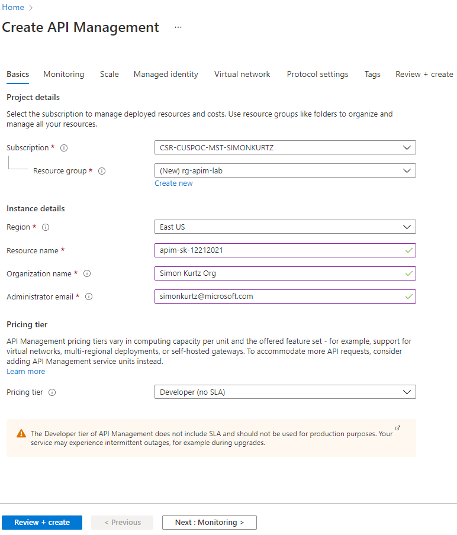
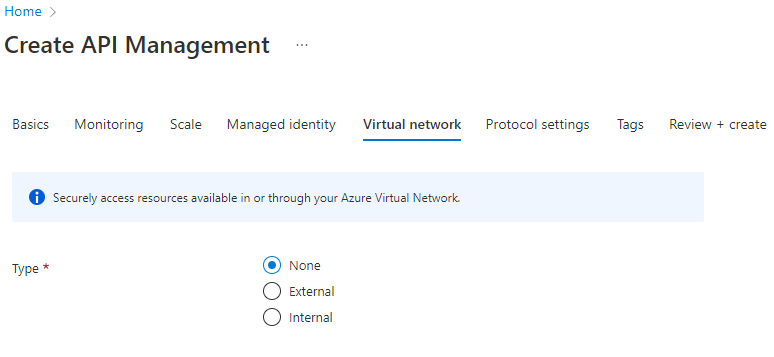
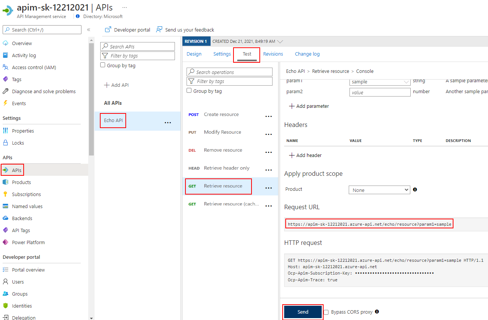
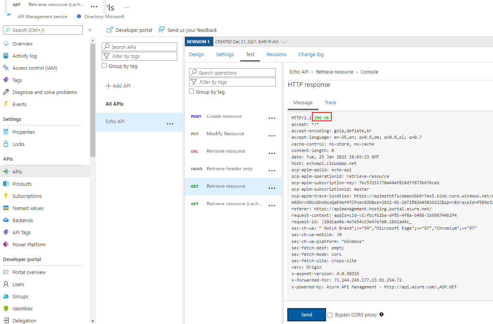
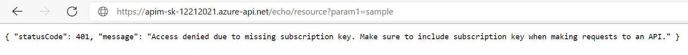
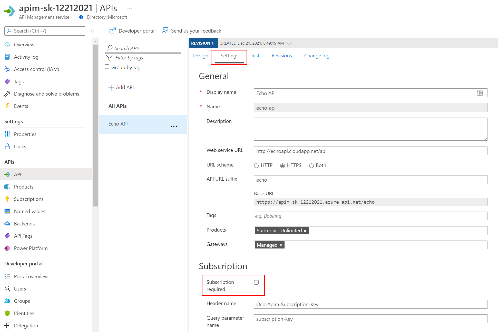
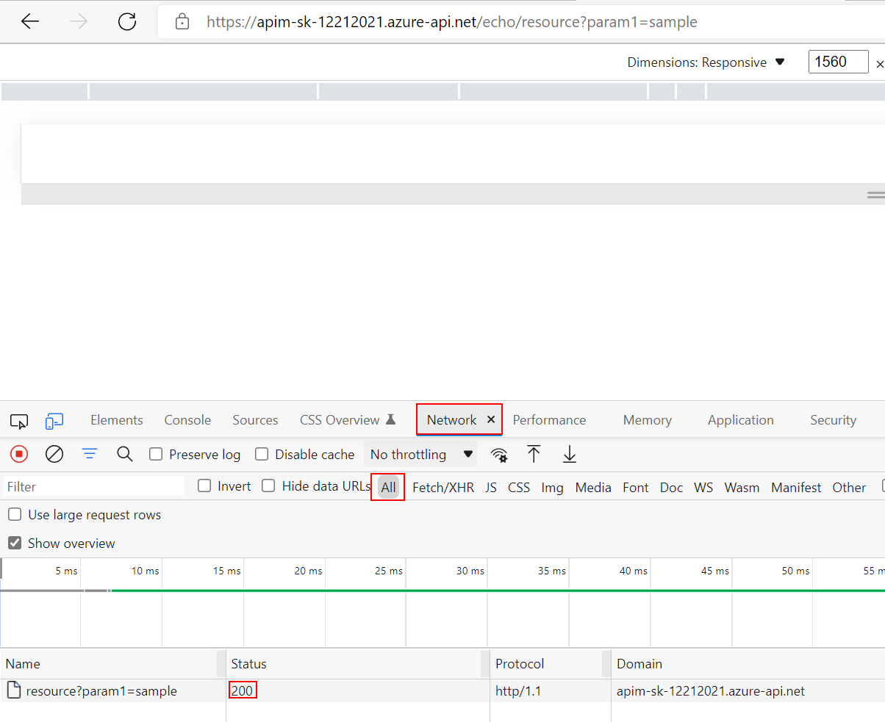
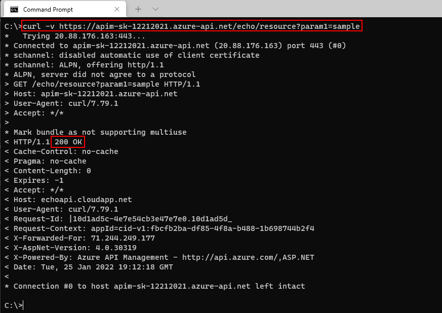

## API Managementインスタンスの作成

API Managementインスタンスのプロビジョニングに時間がかかる場合があります。45分から75分程度を見込んでください。**そのため、デモの前にインスタンスを作成してください。**

独自または[Azureの一般的な命名規則](https://docs.microsoft.com/azure/cloud-adoption-framework/ready/azure-best-practices/resource-naming)を使用して、各必須フィールドに入力し、 *Review + Create* 、*Create* の順に押して、サービスをプロビジョニングします。

> このAPI Managementインスタンスは完全に演習目的であり、Workshop参加者に共通の出発点を提供するためにアプローチが簡素化されていることに留意してください。そのため、ここでお願いしている以上の設定は変更しないでください。後でAPI Managementインスタンスを再作成する必要が生じる可能性があり、時間的なコストがかかります。

プロビジョニング開始後は、このページやAzure Portalに留まる必要はありません。有効なメールアドレスを入力した場合、プロビジョニング完了のメールが届きます。

**サービス名 (=インスタンス名) は一意でなければならない** 点にご注意ください。イニシャルと数字の日付を入れることをお勧めします。

> サービス名は、このWorkshopでURLを形成するために必要になるので、メモしておいてください。

[最低コストですべての関連機能を提供する](https://azure.microsoft.com/pricing/details/api-management/#pricing) **開発者** SKUをご利用ください。

その他の設定は変更しないでください。特に、*Virtual network* タブは **None** のままにしてください。このWorkshopの後半で、API Managementへのアクセスを保護するためのベストプラクティスについて言及します。

## API Managementインスタンスの検証

API Managementインスタンスが作成されたら、以下の手順で正常に機能することを確認してください。

1) Azure Portal で新しく作成された API Managementインスタンスに移動します。
2) *APIs* ブレードを選択し、*Echo API* を選択します。
3) *Test* タブをクリックし、*GET Retrieve resource* 操作を選択します。
4) *Send* を押して、簡単なリクエストを発行します。

  

5) `200` Success 応答を確認します。

  

これでAPI Managementインスタンスのセットアップの確認は完了です。

### 検証に失敗する場合（成功するために）

*Request URL* に気づいて、そのURLをブラウザに入れたり、CURLでリクエストを送信したりしたくなったかもしれませんが、その場合に、`401` エラーが表示され、どうしたものかと思うかもしれません。

この不正アクセスのステータスコードの理由は、 *Echo API* ではサブスクリプションキーが設定されている必要があるためです。API Managementから発信されたテストは自動的にこれを考慮しますが、外部の発信者はこれを考慮することができません（当然、考慮すべきではありません）。

API Managementに戻って、*Settings* タブに切り替え、 *Subscription required* のチェックを外し、ページ下部の *Save* を押してください。

> サブスクリプションは重要で便利ですが、ここでは API Managementインスタンスが意図通りに動作することをすばやく確認したいためにこの操作を実施します。

今度はブラウザでリンクにアクセスしても、エラーメッセージが表示されないはずです。実際、200を確認するには、Developerツール（F12）を開き、*Network* タブに移動して、 *All* （すべてのリクエスト）から200を確認するのが最も簡単です。

別の方法として、 *Echo API* に対して詳細な (`-v`) CURL コマンドを発行し、`200` Success を確認することもができます: `curl -v https://<your apim instance>.azure-api.net/echo/resource?param1=sample`

